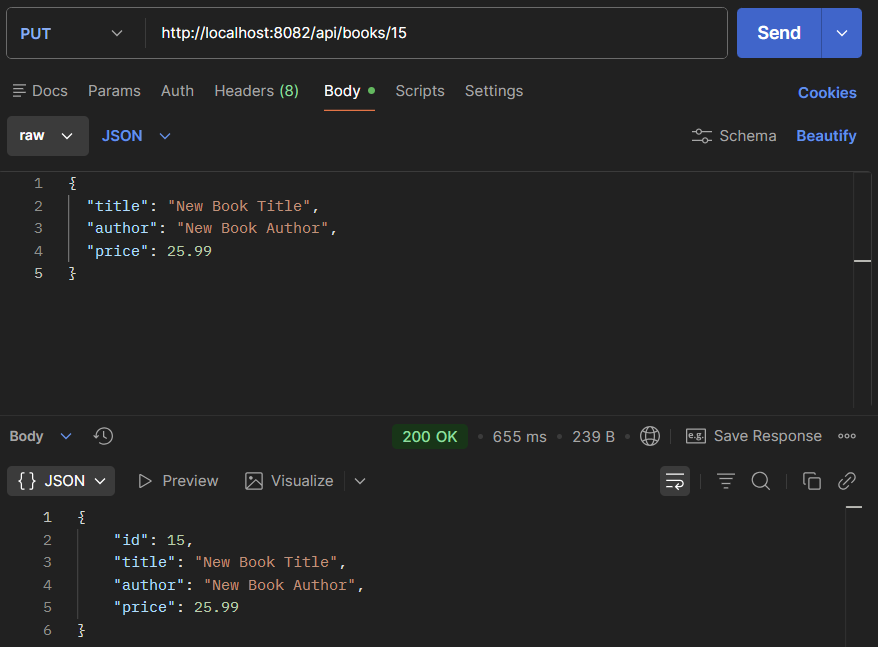
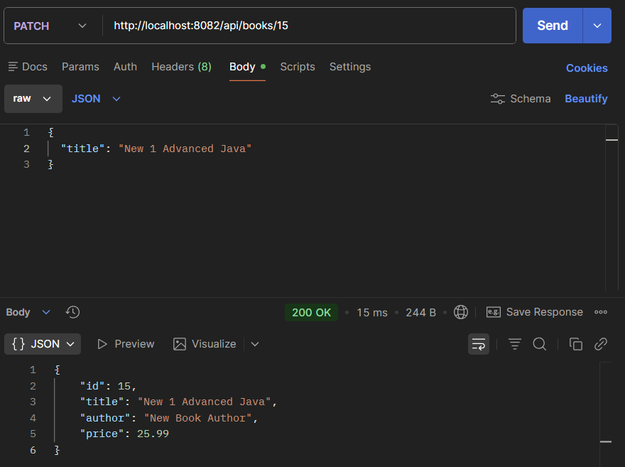
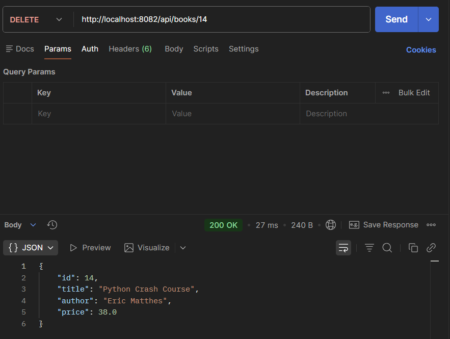
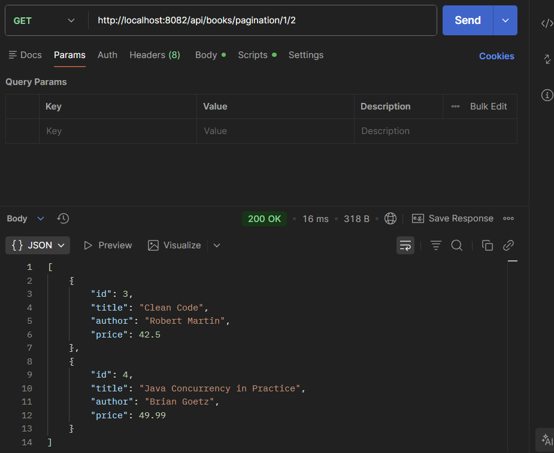
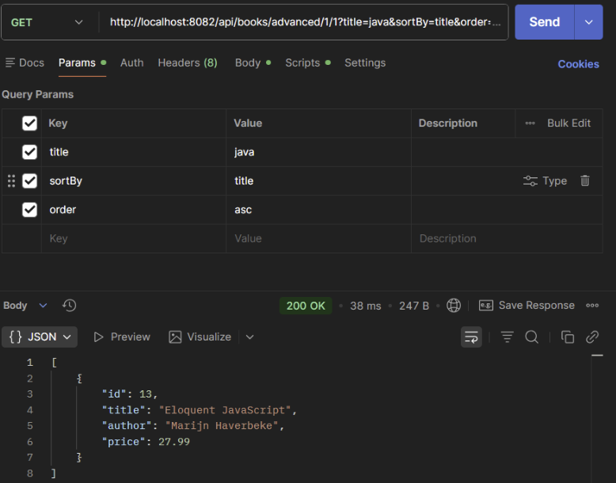

PUT endpoint (update book)
	http://localhost:8082/api/books/15
	

PATCH endpoint (partial update)
	http://localhost:8082/api/books/15
	
	
DELETE endpoint (remove book)
	http://localhost:8082/api/books/14
	
	
GET endpoint with pagination
	http://localhost:8082/api/books/pagination/1/2
	
	
Advanced GET endpoint with filtering, sorting, and pagination combined in the valid order
	http://localhost:8082/api/books/advanced/1/1?title=java&sortBy=title&order=asc
	
